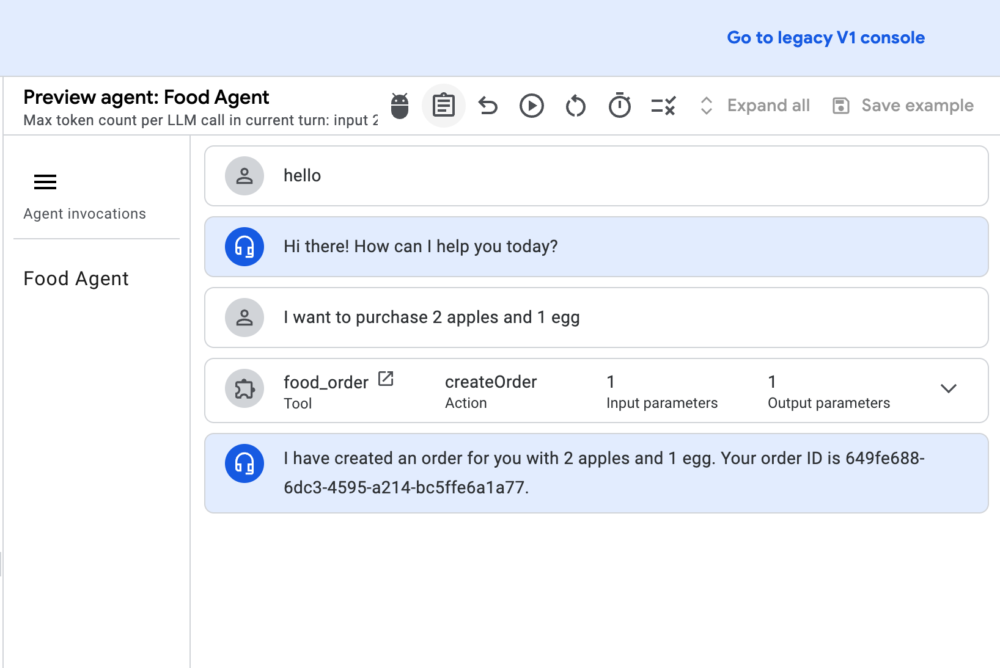
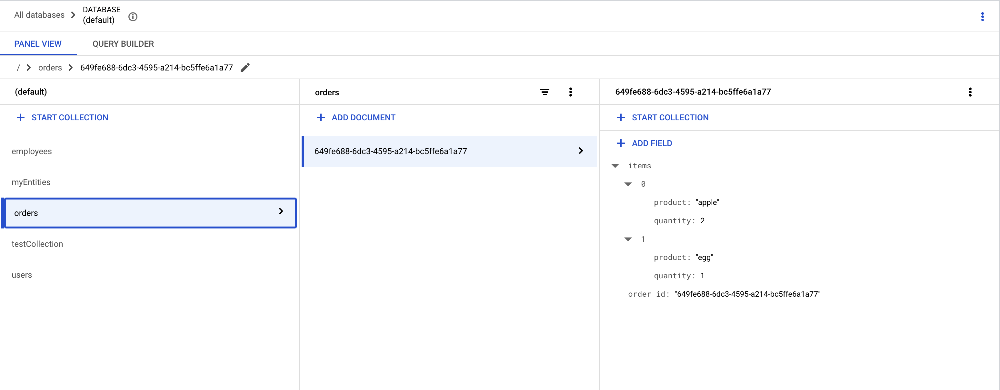

# Briefing
This repo is to demonstrate how to use tool to create the order service using OpenAPI and Cloud Firestore.

This demo includes calling the tool via the OpenAPI specification from the agent to create an order, returning the order ID, and persisting the order data in Cloud Firestore.

# Prepare the environment and deploy and start the service

- Create a GCE instance to deploy the order service.
- Install the packages.
```
python3 -m venv food-order
source food-order/bin/activate
pip install -r requiremements.txt
python3 app.py
```

# Order service access
 The public access is http://gce-public-ip:8080
```
 * Serving Flask app 'app'
 * Debug mode: on
 * Running on all addresses (0.0.0.0)
 * Running on http://127.0.0.1:8080
 * Running on http://10.0.0.8:8080
```

# Create the tool in the [agent builder](https://cloud.google.com/products/agent-builder?hl=en)

- name: food_order
- Type: OpenAPI
- Descriptions:
```
This tool analyzes customer purchases.  Submit the data as a JSON object with a single key, 'items', and a value that's an array of objects representing the purchased items. For example:

JSON
{ "items": [{"product": "item1", "quantity": 1}, {"product": "item2", "quantity": 2}] }
```
- Schema
```
openapi: 3.0.0
info:
  title: Order API
  version: 1.0.0
servers:
  - url: 'http://gce-public-ip:8080'
paths:
  /orders:
    post:
      summary: Create a new order
      operationId: createOrder
      description: Creates a new order with a list of items.
      requestBody:
        required: true
        content:
          application/json:
            schema:
              type: object
              properties:
                items:
                  type: array
                  minItems: 1
                  maxItems: 10
                  uniqueItems: true
                  items:
                    type: object
                    properties:
                      product:
                        type: string
                        description: Name of the product.
                      quantity:
                        type: integer
                        description: Quantity of the product.
      responses:
        '201':
          description: Order created successfully.
          content:
            application/json:
              schema:
                type: object
                properties:
                  order_id:
                    type: string
                    description: Unique identifier of the created order. 
        '400':
          description: Bad Request - Invalid input data.
        '500':
          description: Internal Server Error.
```
- Authentication type: Service agent token
- Service agent auth type: ID token

# Create the Agent and provide the Agent Instructions to use the tool
```
- Use ${TOOL:food_order} to help users purchase items,return the order id.
```

# Order persistence
Cloud Firestore is used to store and manage customer orders. The order_service.py module handles the logic for creating, retrieving, updating, and deleting order data in Firestore.

# Screen capture
- Agent creates the order

- Order persistence in Cloud Firestore

